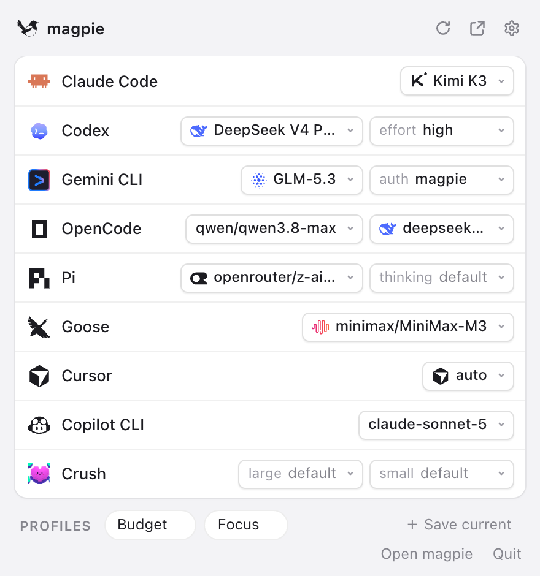
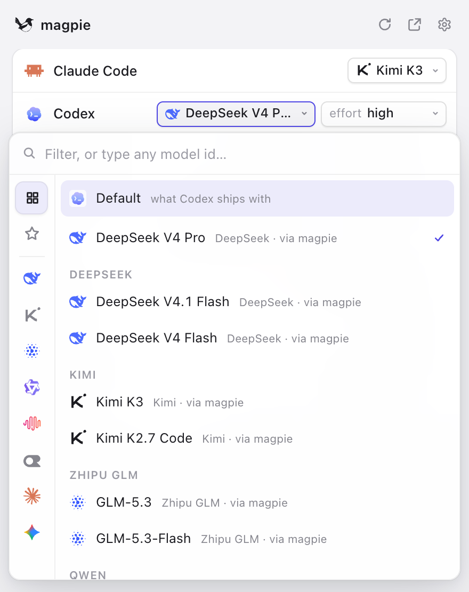
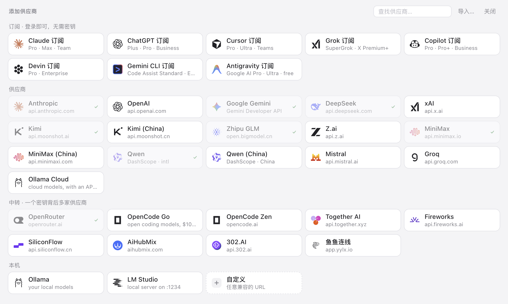
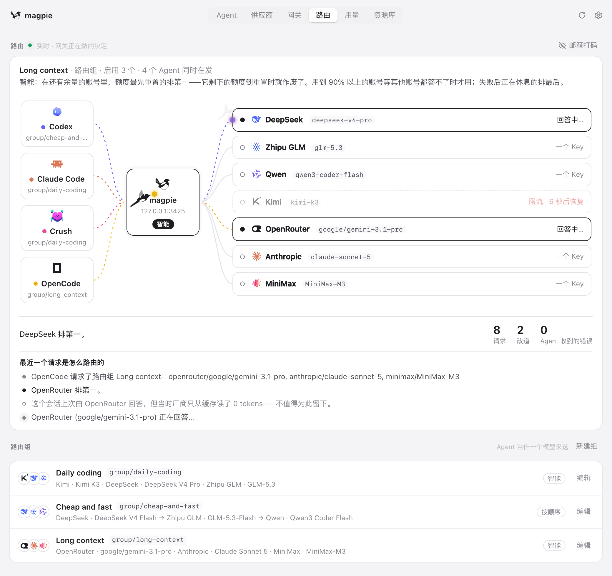
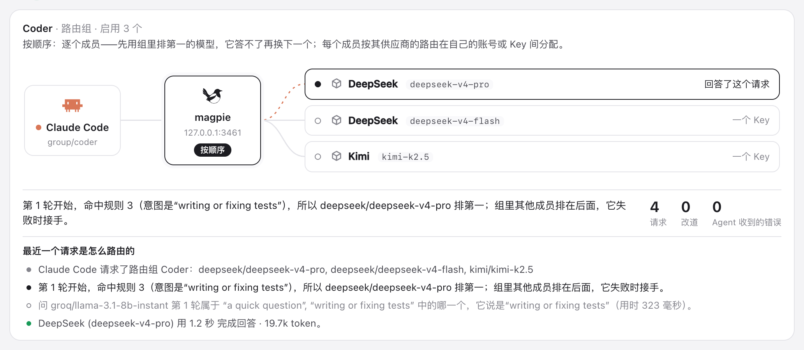
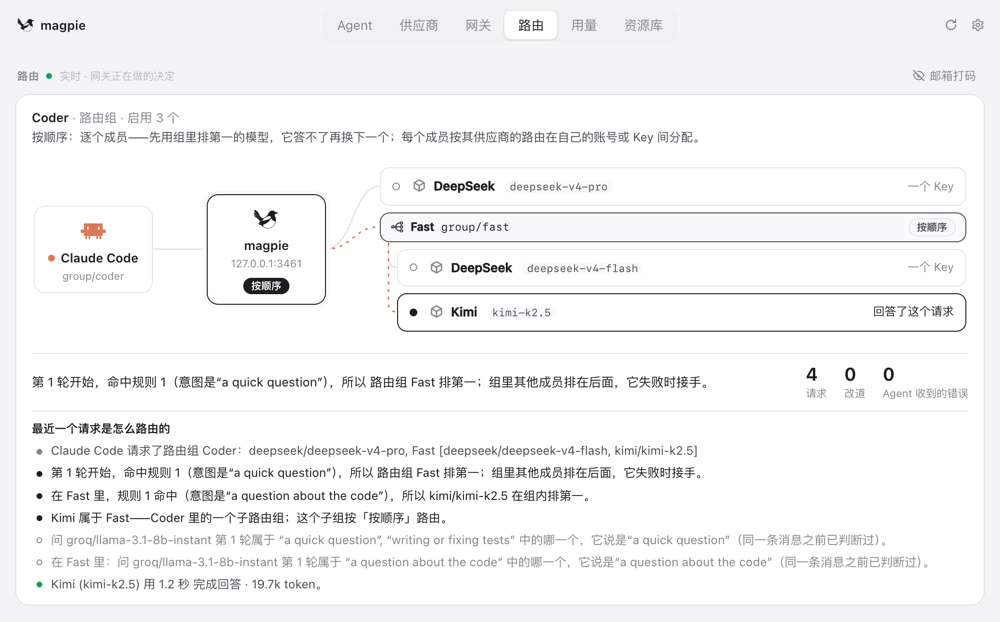
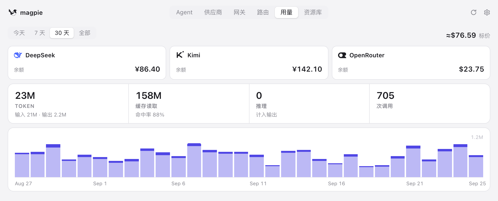

<div align="center">

<a href="https://usemagpie.ai/zh/"></a>

# magpie

### 所有 Agent 的模型，一处搞定。

Claude Code 跑 Kimi，Codex 跑 DeepSeek，Gemini CLI 跑 GLM，OpenCode 用你的 ChatGPT 订阅。<br>
在菜单栏一点就能切换。所有 Agent 都走同一个本地网关，额度用完时自动切到下一个账号。

[](https://github.com/yetone/magpie-releases/releases/latest) [](https://github.com/yetone/magpie/stargazers) [](https://discord.gg/vGSnD3ZKQF) [](LICENSE)<br>
    

**[下载](https://usemagpie.ai/zh/)** · **[文档](https://usemagpie.ai/docs/zh/start)** · **[完整参考（英文）](docs/reference.md)** · **[Discord](https://discord.gg/vGSnD3ZKQF)** · [English](README.md) · **简体中文**

<br>

<picture>
  <source media="(prefers-color-scheme: dark)" srcset="site/public/img/agents-zh-dark.png">
  
</picture>

</div>

<br>

## 为什么需要 magpie

你大概不止用一个编程 Agent。每个 Agent 都把模型写在自己的配置文件里，格式各不相同，key 和 base URL 也各管各的。支持哪些厂商，也是每个 Agent 自己说了算。你花钱买的订阅只能在一个 Agent 里用。下午三点额度用完，你就得开始手改配置文件。

magpie 把这些都收到一处：

<table>
<tr>
<td width="33%" valign="top">

**🎛 一个界面管所有 Agent**<br>
35+ 个 Agent 列在一张表里。点一下模型，换成别的。magpie 只改 Agent 配置文件里的那一个键，注释、顺序和格式都原样保留。

</td>
<td width="33%" valign="top">

**🔌 一个网关兼容所有 API**<br>
`127.0.0.1:3425` 同时支持 OpenAI Chat、OpenAI Responses、Anthropic Messages 和 Gemini 四种 API，并在它们之间互相转换，流式输出、工具调用和推理都照常可用。

</td>
<td width="33%" valign="top">

**🔀 不中断的路由**<br>
把多个厂商的多个模型放进一个路由组。一个被限流或额度用完，下一个接着回答。Agent 看不到报错。

</td>
</tr>
<tr>
<td valign="top">

**🔑 订阅可以共享**<br>
你登录的 Claude、ChatGPT、Copilot、Gemini 或 Grok 会变成一个 provider，其他所有 Agent 都能用，不用复制任何 key。

</td>
<td valign="top">

**🧩 插件**<br>
npm 上的 OpenCode 登录插件和 pi provider 包，在 magpie 里的用法和在原应用里一样。插件能登录的套餐，每个 Agent 都能用。插件也可以是网关中间件，读取并改写每个请求和回复。

</td>
<td valign="top">

**📊 用量和费用统计**<br>
每个 provider 和账号的 token、缓存命中、按官方价格估算的费用、余额和额度窗口都看得到，还能给每个 key 设用量上限。

</td>
</tr>
</table>

<br>

## 给任意 Agent 选任意模型

点一个值，就会弹出可搜索的列表，里面是你添加的所有 provider 的所有模型，格式为 `provider/model`。选好后，magpie 会安全地以原子写入的方式改写 Agent 的配置文件。用**配置档（Profiles）**可以把所有 Agent 的当前设置存成一个名字（如「省钱」「专注」），之后一键整体切换。

magpie 常驻**菜单栏**：macOS、Windows 和 Linux 上都有托盘面板，此外还有完整窗口、**TUI**（`magpie tui`）、**网页界面**（`magpie web`）和命令行。

<table>
<tr>
<td width="50%">
<picture>
  <source media="(prefers-color-scheme: dark)" srcset="site/public/img/panel-dark.png">
  
</picture>
</td>
<td width="50%">
<picture>
  <source media="(prefers-color-scheme: dark)" srcset="site/public/img/picker-dark.png">
  
</picture>
</td>
</tr>
</table>

## 添加 provider，只需一个 key

选一个预设，粘贴 key，就完成了。模型列表直接从厂商获取，名称和推理档位由 [models.dev](https://models.dev) 补全。今天早上刚发布的模型，下次刷新就会出现。magpie 本身不内置任何模型列表。

**预设包括** Anthropic · OpenAI · Google Gemini · DeepSeek · Kimi · 智谱 GLM · MiniMax · 阶跃星辰 · 通义千问 · 百度千帆 · 腾讯云 · 华为云 MaaS · 火山方舟 · Mistral · Groq · xAI · OpenRouter · Together · Fireworks · 硅基流动 · NVIDIA NIM · 魔搭 · Ollama · LM Studio ……以及任何兼容 OpenAI 或 Anthropic 的地址。

<picture>
  <source media="(prefers-color-scheme: dark)" srcset="site/public/img/add-zh-dark.png">
  
</picture>

已经在别的工具里配好了？**导入**功能可以读取你在 CC Switch、Claude Code、Codex 和 Alma 里配置的 provider。**[「添加到 magpie」链接](https://usemagpie.ai/docs/zh/import)**让 provider 网站一键把配置交给 magpie。

## 不中断的路由

**路由组**是 Agent 当作一个模型来选的一组模型，例如 `group/daily-coding`。网关会把请求分配到所有成员的 key 和账号上：

| 模式 | 作用 |
| --- | --- |
| `smart` | 在还有额度的订阅里，先用额度最快重置的那个，重置时浪费最少 |
| `order` | 先用第一个，答不了再用下一个 |
| `rotate` | 每轮对话换下一个成员 |
| `usage` | 先用用得最少的成员 |
| `pace` | 按周节奏：先用距重置每小时剩余额度最多的账号 |

在厂商的提示缓存还值得保留时，同一段对话会**留在回答它的那个账号上**。**意图路由**更进一步：由你选的一个小模型判断每轮新对话问的是什么，写测试交给强模型，简单问题交给又快又便宜的模型。路由组可以嵌套。路由页实时显示每一次路由决策。

<picture>
  <source media="(prefers-color-scheme: dark)" srcset="site/public/img/routing-zh-dark.png">
  
</picture>

<table>
<tr>
<td width="50%">
<picture>
  <source media="(prefers-color-scheme: dark)" srcset="site/public/img/intent-trace-zh-dark.png">
  
</picture>
</td>
<td width="50%">
<picture>
  <source media="(prefers-color-scheme: dark)" srcset="site/public/img/nested-routing-zh-dark.png">
  
</picture>
</td>
</tr>
</table>

→ [意图路由详解](https://usemagpie.ai/docs/zh/intent)

## 登录一次，处处可用

你登录过的 Agent 本身就是一份带模型的订阅，magpie 把它作为 provider 提供出来。每种订阅可以登录多个账号，magpie 会在账号之间自动切换。

- **Claude**：调用本机真正的 `claude` 程序，通过 MCP 把你 Agent 的工具接进去
- **Codex / ChatGPT**：ChatGPT 套餐里的模型，其他 Agent 都能用
- **GitHub Copilot**、**Gemini（Code Assist）**、**Antigravity**、**Grok（SuperGrok）**、**Devin**、**Cursor** 等
- **npm 上任何 OpenCode 登录插件或 pi 包**：

```sh
magpie plugin add opencode-gemini-auth   # npm 上的 OpenCode 插件
magpie plugin add pi-antigravity         # pi 包，用法相同
magpie plugin login google-plugin        # 在 magpie 里走插件自己的登录流程
```

插件运行在 [Bun](https://bun.sh) 上，magpie 会在第一次需要时自动下载 Bun。插件负责登录、列出模型和发送请求，Agent 像用其他 provider 一样用它的模型。社区插件在 **[magpie-community/plugins](https://github.com/magpie-community/plugins)**，你也可以[自己写一个](https://usemagpie.ai/docs/zh/plugins)。

插件也可以是**网关中间件**：在 magpie 网关里运行的 JavaScript，处理每个 Agent 发出和收到的内容，不管走的是哪个 provider。`onRequest` 可以改写请求或拒绝它，`onEvent` 处理流式回复的每个事件，`onResponse` 处理完整回复。它在进程内运行，每个事件约一微秒；钩子出错或超时，请求按原样放行。

```js
// alias.middleware.js — magpie plugin add ./alias.middleware.js
export function onRequest(body, ctx) {
  if (body.model === "fast") return { ...body, model: "deepseek/deepseek-chat" };
}
```

现成的中间件在「插件 › 发现 › 网关中间件」里，大多是 [New API](https://github.com/QuantumNous/new-api) 为渠道提供的功能，JSON 也一样：

| 包 | 作用 |
|---|---|
| `param-override` | New API 的参数覆盖（`param_override`）：按条件设置、删除、移动或改写请求字段，或拒绝请求 |
| `model-map` | New API 的模型重定向（`model_mapping`）：换个模型名发出，回复里仍是请求的名字 |
| `system-prompt` | 给每个请求（或某些 agent、模型）加上你的系统提示词 |
| `word-guard` | New API 的敏感词过滤：用户发送的内容里有敏感词时拒绝或打码，回复也可打码 |
| `think-tags` | 去掉回复里的 `<think>…</think>`，或把 `reasoning_content` 放进正文 |

```sh
magpie plugin add @magpie-community/middleware-model-map
magpie plugin options model-map '{"mapping": {"fast": "deepseek/deepseek-chat"}}'
```

详见[网关中间件](https://usemagpie.ai/docs/zh/plugins#middleware)。

## 用量和费用统计

<picture>
  <source media="(prefers-color-scheme: dark)" srcset="site/public/img/usage-zh-dark.png">
  
</picture>

- token、缓存读写、推理 token 和调用次数，以及**按官方价格估算的费用**。每个模型的价格也可以自己设置。
- 每个 key、套餐和订阅账号的**余额与额度窗口**（`magpie quota`）。额度快重置却还剩很多没用时，**重置提醒**会提前通知你。
- 按**会话**统计：每段 Agent 对话的费用和标题，以及恢复它的命令。
- 按**账号**和**上游 key** 统计，方便逐条核对厂商账单。
- 支持 **OTLP 导出**到你自己的可观测平台。

## 一个 magpie，多台设备共用

- **局域网共享**：打开「在局域网共享」，为每个客户端创建一个命名的**网关 key**，每个 key 可以单独设置按日、周或月的 token 和费用上限。
- **远程 magpie**：笔记本可以直接用台式机上 magpie 的 provider、账号和路由组，同时仍由笔记本自己的 magpie 配置本机的 Agent。
- **Docker**：在服务器或 NAS 上运行 `ghcr.io/yetone/magpie`，通过网页界面管理。
- **同步**：可以备份到文件，也可以通过 WebDAV（坚果云、Nextcloud……）或 S3 在多台机器之间同步。

## 资料库：指令、MCP 和 Skills

指令、MCP 服务器和 Skills 只需写一次。magpie 会按每个 Agent 自己的格式写进它自己的文件。删除时只删 magpie 写入的部分，文件里的其他内容保持不变。

## 支持的 Agent

<table>
<tr><td>

Claude Code · Claude Desktop · Codex · Gemini CLI · OpenCode · OpenChamber · MiMo Code · Pi · Aside · OmO · Goose · Cursor CLI · Zed · VS Code Chat · JetBrains Air · Copilot CLI · Crush · DeepSeek Harness · Command Code · fx · oh-my-pi · Devin · Hermes Agent · Mister Morph · Kimi Code · Muse Code · Empryo · MiniMax Code · Droid · Cline · Qoder · Qoder CN · Grok Build · ZCode · WorkBuddy · CodeBuddy Code · T3 Code · OpenHanako · AtomCode · Alma

</td></tr>
</table>

magpie 只显示本机已安装的 Agent。其他任何能设置 base URL 的工具也可以接入网关：

```sh
export OPENAI_BASE_URL=http://127.0.0.1:3425/v1     OPENAI_API_KEY=magpie
export ANTHROPIC_BASE_URL=http://127.0.0.1:3425     ANTHROPIC_API_KEY=magpie
export GOOGLE_GEMINI_BASE_URL=http://127.0.0.1:3425 GEMINI_API_KEY=magpie
```

## 快速开始

**1. 安装。**从 **[usemagpie.ai](https://usemagpie.ai/zh/)** 下载应用，或者运行：

```sh
curl -fsSL https://usemagpie.ai/install.sh | sh
```

<sub>Mac 版已签名并经过公证，所有版本都会自动更新。网络受限时可以用 `--proxy` 或 `--mirror`。也可以用 `go install github.com/yetone/magpie@latest` 安装，或使用 [Docker 镜像](docs/reference.md#docker)。</sub>

**2. 添加 provider。**打开 magpie，进入 **Providers → 添加 provider**。选一个预设，或者用订阅账号登录。

**3. 选模型。**在 **Agents** 页给每个 Agent 选一个模型。新开的 Agent 会话就会用上新模型。

也可以全部在终端里完成：

```sh
magpie provider add deepseek sk-…              # 预设只需要 key
magpie claude deepseek/deepseek-v4-pro          # Claude Code 用 DeepSeek
magpie codex moonshot/kimi-k2.5                 # Codex 用 Kimi
magpie group add "Opus anywhere" models=claude/claude-opus-5-5,copilot/claude-opus-5.5 routing=smart
magpie claude group/opus-anywhere               # 在多个订阅之间自动切换
magpie save work && magpie use work             # 配置档
magpie quota                                    # 查看每个套餐还剩多少额度
magpie tui                                      # 终端版完整界面
```

## 文档

- **[快速上手](https://usemagpie.ai/docs/zh/start)**：入门导览
- **[完整参考](docs/reference.md)**（英文）：每个 Agent、provider 选项、网关接口、CLI 命令和文件
- **[插件](https://usemagpie.ai/docs/zh/plugins)**：使用插件和编写插件
- **[意图路由](https://usemagpie.ai/docs/zh/intent)**：按每轮对话的内容选择模型
- **[导入链接](https://usemagpie.ai/docs/zh/import)**：给 provider 网站用的「添加到 magpie」按钮

## 社区

有问题、有想法，或者某个模型没显示出来？欢迎加入 **[Discord](https://discord.gg/vGSnD3ZKQF)**，或者[提一个 issue](https://github.com/yetone/magpie/issues)。

如果 magpie 让你少改了一次配置文件，**点个 ⭐ 能让更多人发现它。**

<a href="https://star-history.com/#yetone/magpie&Date">
  <picture>
    <source media="(prefers-color-scheme: dark)" srcset="https://api.star-history.com/svg?repos=yetone/magpie&type=Date&theme=dark">
    
  </picture>
</a>

## 许可证

[MIT](LICENSE)
